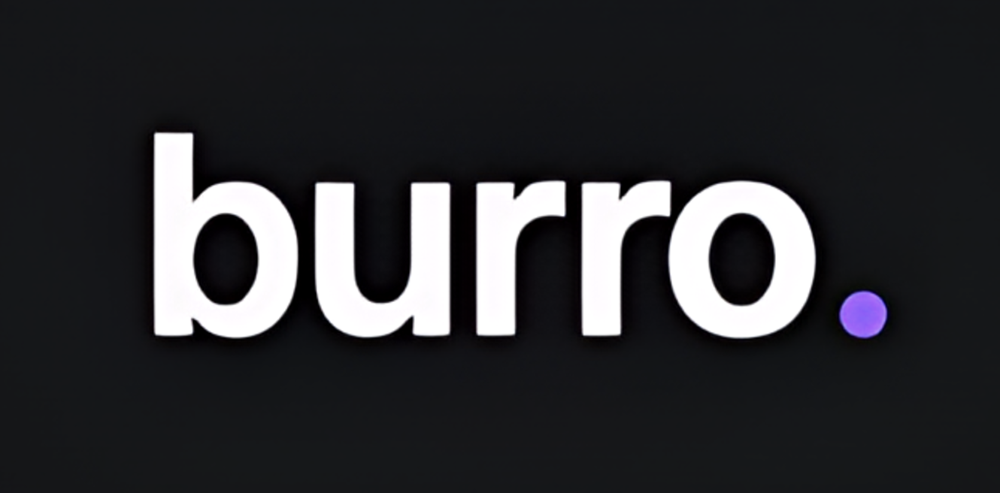
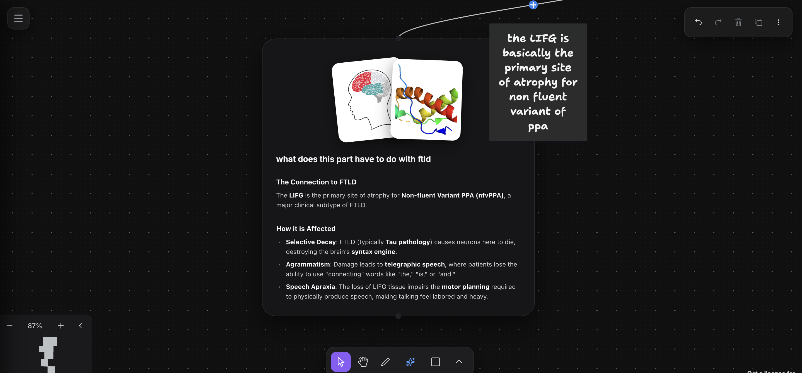
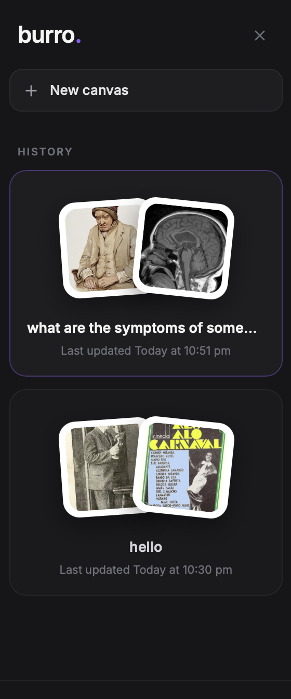
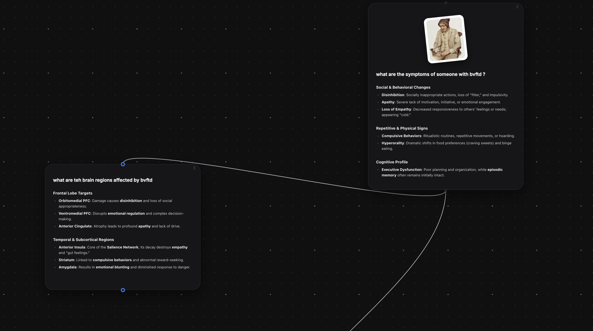

<a href="https://github.com/pranavajy/burro">
  <h1 align="center">
    <picture>
      
    </picture>
  </h1>
</a>

<p align="center">
  <a href="https://github.com/pranavajy/burro/actions">
    
  </a>
  <a href="https://vitejs.dev/">
    
  </a>
  <a href="https://tailwindcss.com/">
    
  </a>
  <a href="https://workers.cloudflare.com/">
    
  </a>
  <a href="LICENSE.md">
    
  </a>
</p>

---

Burro is an open-source, full-stack branching conversation canvas that lets you craft, connect, and explore AI-guided dialogues on an infinite workspace. Built on top of **tldraw**, it converts conversation segments into interactive node structures, allowing you to branch prompts, visualize context lineages, and query AI streaming responses in real-time.

## Preview

<p align="center">
  
</p>

<p align="center">
  
  
</p>

---

## Features

*   **Visual Chat Trees**: Design custom branching conversation threads on an infinite tldraw canvas.
*   **Context-Aware AI**: The backend automatically tracks parent port lineages to feed structural context into Gemini prompts.
*   **High-Performance Streaming**: Enjoy instant responses streamed chunk-by-chunk using Vercel AI SDK on Cloudflare Workers edge.
*   **Wikipedia Polaroid Stack**: Automatically queries matching reference photos in parallel and renders them as hover-interactive fanned cards.
*   **Sleek Glassmorphic Design**: Clean cards styled with Tailwind CSS v4, dark canvas overlays, custom input controls, and smooth hover micro-animations.

---

## Architecture

Burro uses a decoupled architecture optimized for low-latency visual data orchestration:

### Frontend (`/client`)
*   **Rendering Core**: Custom tldraw shape utilities (`NodeShapeUtil`) and port connections mapping canvas points.
*   **Styling**: Powered by Tailwind CSS v4, providing glassmorphic card overlays (`bg-[#1C1C1C] border-[#2C2C2C]`) and custom hover states.
*   **State Control**: Interactive toolbar custom docked to the bottom center, quick actions docked to the top right, and slide-out setting sheets.

### Backend (`/worker`)
*   **Edge Compute**: Cloudflare Workers router hosting streaming endpoints.
*   **AI SDK**: Integrates Vercel AI SDK with Gemini `gemini-3-flash-preview` to stream concise, bolded, bulleted markdown completions.

---

## Quick Start

### 1. Install Dependencies

Clone the repository and install packages using your package manager:
```bash
npm install
```

### 2. Environment Configuration

Create a `.env` file in the project root:
```env
GOOGLE_GENERATIVE_AI_API_KEY=your_gemini_api_key_here
```
> Get your API key from [Google AI Studio](https://aistudio.google.com/apikey).

### 3. Start Development

Run the local development server:
```bash
npm run dev
```
Open [http://localhost:5173](http://localhost:5173) in your browser.

---

## How to Use

1.  **Add Message Cards**: Drag the message tool from the bottom center dock onto the canvas.
2.  **Connect conversation paths**: Hover over the bottom port of a node and drag a connector to the top input port of another node to construct a branch.
3.  **Prompt & Stream**: Type inside any un-sent card and hit enter to stream the assistant's response. Once sent, the prompt locks as a static reference.
4.  **Branch Conversations**: Drag from any completed node's bottom port to spawn alternative paths, allowing you to test variations or dive deeper into subtopics.

---

## Customization

### Adding New Node Types
1.  Define a new schema and component in `client/nodes/types/`.
2.  Register the model in `NodeDefinitions` in `nodeTypes.tsx`.
3.  Implement layout functions: `Component`, `getPorts`, `getBodyHeightPx`.

### Switching AI Providers
Configure `worker/worker.ts` to swap the `@ai-sdk/google` provider with any model supported by the Vercel AI SDK (e.g. `@ai-sdk/openai`, `@ai-sdk/anthropic`).

---

## Deployment

Deploy the serverless Edge worker and compile frontend assets:
```bash
# Compile and build client
npm run build

# Deploy to Cloudflare Network
npx wrangler deploy
```

***

## License

This project is licensed under the MIT License. The canvas engine is powered by the [tldraw SDK](https://tldraw.dev).
