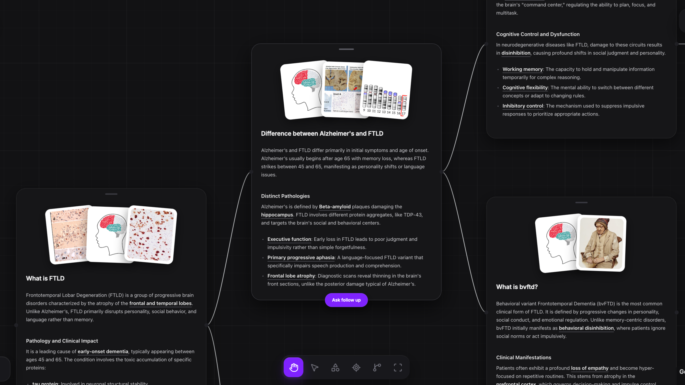
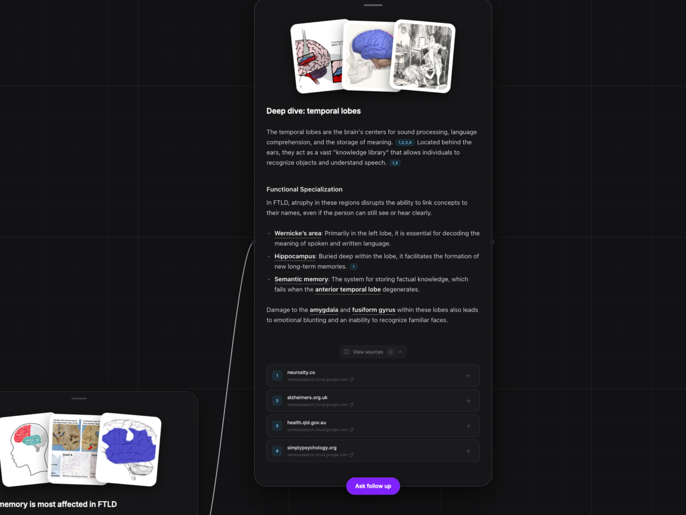
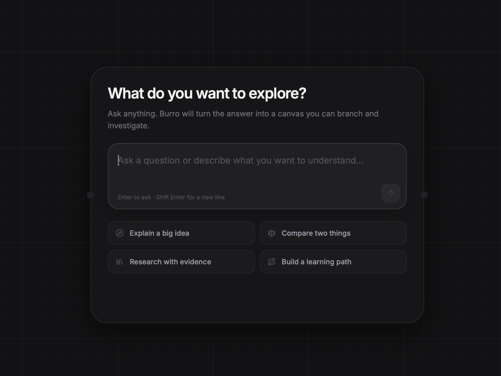

<p align="center">
  <a href="https://github.com/pranavajy/burro">
    
  </a>
</p>

<p align="center">
  A visual AI workspace for exploring questions, branching into ideas, and keeping evidence attached.
</p>

<p align="center">
  <a href="LICENSE.md"></a>
  
  
  
</p>

---

Burro turns linear AI conversations into spatial maps of understanding. Start with a question, branch from any answer or highlighted concept, inspect the sources behind important claims, and keep every useful path visible on an infinite canvas.

## Product preview

<p align="center">
  
</p>

<p align="center">
  
  
</p>

## What Burro does

- **Branching conversations** — Follow up from any completed answer while preserving the full path of context.
- **Web-grounded responses** — Gemini Google Search grounding provides inline citation markers and source metadata when available.
- **Evidence inspection** — Expand a compact source section or open connected source cards for important claims.
- **Concept deep dives** — Click underlined concepts to generate focused child branches automatically.
- **Visual research cards** — Relevant reference images appear as interactive, previewable photo stacks.
- **Structured layouts** — Conversation trees flow left-to-right and can be tidied automatically.
- **Compact mode** — Collapse completed cards into title-only nodes, then expand an individual card on demand.
- **Persistent canvases** — Local canvas history includes visual thumbnails, search, and recently updated ordering.
- **Draft-aware history** — Empty new canvases are discarded when you navigate away instead of becoming stray “Untitled” entries.
- **Canvas tools** — Grab, select, draw, add shapes, highlight, frame, and customize the workspace using the compact dock.

## Experience

### Start cleanly

New canvases open with a focused composer and prompt starters. Canvas utilities remain hidden until the first question is submitted, keeping the initial state calm and intentional.

### Explore naturally

Hover over a completed card and choose **Ask follow up**, or select an underlined concept to create a deep-dive branch. Burro carries the relevant parent conversation into the new request.

### Verify important claims

Grounded responses can include citation markers and a centered **View sources** control. Source cards use a secondary dashed connection style so evidence remains visually distinct from the conversation itself.

## Tech stack

| Layer | Technology |
| --- | --- |
| UI | React 19, TypeScript, Tailwind CSS v4 |
| Canvas | tldraw 5 with custom shapes, bindings, ports, and overlays |
| Motion | Framer Motion |
| Search UI | cmdk |
| AI | AI SDK with Google Gemini |
| Grounding | Gemini Google Search tool |
| Runtime | Cloudflare Workers |
| Build | Vite 8 |

## Project structure

```text
client/
├── App.tsx                       # Canvas app, sidebar, history, and app chrome
├── LandingPage.tsx               # Public product landing page
├── components/WorkflowToolbar.tsx
├── connection/                   # Custom connection shapes and bindings
├── nodes/                        # Node utilities, layouts, and creation flows
│   └── types/
│       ├── MessageNode.tsx       # Composer, streaming answer, citations, images
│       └── SourceNode.tsx        # Connected evidence cards
└── ports/                        # Connection-port interaction state

worker/
├── worker.ts                     # Streaming AI and grounding endpoints
└── types.ts                      # Worker environment bindings
```

## Getting started

### Requirements

- Node.js 20 or newer
- npm
- A Google Generative AI API key

### Installation

```bash
git clone https://github.com/pranavajy/burro.git
cd burro
npm install
```

Create `.env` in the project root:

```env
GOOGLE_GENERATIVE_AI_API_KEY=your_api_key
```

You can create a key in [Google AI Studio](https://aistudio.google.com/apikey).

Start the local development server:

```bash
npm run dev
```

The public landing page is available at `/`. Choose **Open app** or visit `/app` to enter the canvas workspace.

## Scripts

```bash
npm run dev       # Start Vite and the local Cloudflare Worker environment
npm run build     # Type-check and create a production build
npm run preview   # Preview the production build locally
```

## How responses work

1. Burro walks the selected node’s parent connections and reconstructs the relevant message history.
2. The client sends that history to the Worker streaming endpoint.
3. Gemini generates a concise response and invokes Google Search grounding.
4. Text is streamed into the card while relevant images are fetched in parallel.
5. Grounding metadata is normalized into sources and citation ranges for the canvas UI.

The response prompt is intentionally optimized for compact visual cards: it targets 70–100 words, preserves essential context, and marks useful concepts for further exploration.

## Extending Burro

### Add a node type

1. Create its schema, definition, and component in `client/nodes/types/`.
2. Register it in `client/nodes/nodeTypes.tsx`.
3. Define its dimensions and ports.
4. Add any creation and layout behavior required by the conversation tree.

### Change the model or provider

Update `worker/worker.ts` and install the corresponding AI SDK provider package. If the provider exposes different grounding metadata, adapt the evidence normalization in the streaming handler as well.

## Deployment

Build the client and Worker bundle:

```bash
npm run build
```

Deploy with Wrangler after configuring your Cloudflare account, routes, and secret:

```bash
npx wrangler secret put GOOGLE_GENERATIVE_AI_API_KEY
npx wrangler deploy
```

The asset configuration uses single-page application fallback, so both `/` and `/app` resolve correctly.

## License

[MIT](LICENSE.md)
